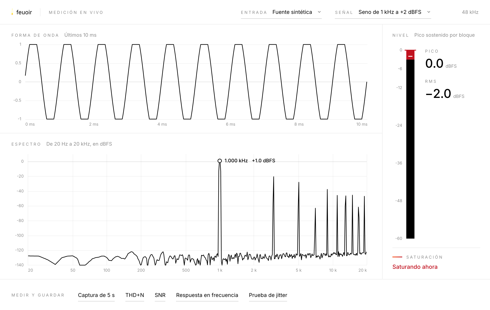

# App de medición en vivo

Una ventana con la forma de onda, el espectro y el nivel de la entrada en vivo, y un botón por cada medición del analizador. Python lee el audio, analiza con analizador.py y guarda; la interfaz, en TypeScript, solo dibuja lo que recibe por WebSocket. Por qué está hecha así: docs/app-cascara.md.



## Instalar y abrir

Una sola vez, desde la raíz del repo:

```
.venv/bin/pip install aiohttp==3.14.3 pywebview==6.2.1
cd app/interfaz && npm install && npm run build
```

Cada vez, desde la raíz del repo:

```
.venv/bin/python -m app
```

Con --navegador abre la misma interfaz en el navegador en vez de una ventana propia. Para trabajar en la interfaz con recarga en caliente: .venv/bin/python -m app --navegador --puerto 8750 en una terminal y npm run dev en app/interfaz en otra, y abrir la dirección que muestra Vite. Vite manda el WebSocket al puerto 8750.

Después de cambiar algo en app/interfaz hay que volver a correr npm run build: la ventana muestra lo compilado en app/interfaz/dist, que no se versiona.

## Cómo está hecha

```
app/fuentes.py      entrada real por sounddevice, o fuente sintética que hace de conversor
app/procesado.py    de bloques a cuadros: pico sostenido, saturación, espectro reducido, forma de onda
app/mediciones.py   un botón por medición: estímulo, grabación, analizador.py y carpeta en mediciones/
app/servidor.py     aiohttp: la interfaz, el WebSocket y su contrato
app/__main__.py     arranque y ventana con pywebview
app/interfaz/       TypeScript y canvas, sin framework, con los tokens de feuoir
```

El recorrido de un bloque:

1. El callback de sounddevice copia el bloque de 1024 muestras a una cola y sale. Corre en el hilo de tiempo real de CoreAudio, y cualquier demora ahí corta el audio.
2. Un hilo saca los bloques de la cola y los pasa por el procesador, que guarda los últimos 200 ms, mira todas las muestras del bloque para el pico y la saturación, y sostiene el pico hasta el próximo cuadro.
3. Hasta 30 veces por segundo el servidor arma un cuadro con lo acumulado y lo manda. A 48 kHz llegan unos 47 bloques por segundo; los dos ritmos no dependen uno del otro.
4. La interfaz guarda el último cuadro y lo dibuja con requestAnimationFrame, solo cuando llegó uno nuevo.

Cada conexión tiene su propia tarea de escritura. De los cuadros se guarda solo el último, así una conexión que se atrasa pierde cuadros viejos y no frena a las demás.

## Qué calcula Python para cada cuadro

- Forma de onda: los últimos 10 ms, desde un cruce por cero subiendo, para que no baile de un cuadro al otro.
- Espectro: analizador.espectro sobre los últimos 200 ms, con bins de 5 Hz y ventana flat-top, reducido a 512 puntos logarítmicos de 20 Hz a 20 kHz. Cada punto se queda con el máximo de los bins que junta, así un tono nunca se pierde. En los graves, donde un punto es más angosto que un bin, se interpola.
- Por qué flat-top: marca el nivel de un tono aunque caiga entre dos bins; con Hann marcaría hasta 1.42 dB menos. A cambio, el piso de ruido se ve unos 4 dB más alto, y sube hacia los agudos porque ahí cada punto toma el máximo de más bins.
- Pico del espectro: el nivel del bin más alto entre 20 Hz y 20 kHz y la frecuencia de analizador.frecuencia_dominante. Debajo de -90 dBFS no se marca.
- Nivel: la barra muestra el pico de los bloques desde el cuadro anterior, la cifra de pico el máximo del último medio segundo y la de RMS los últimos 200 ms.
- Saturación: un bloque satura si alguna muestra llega a menos de un código de 16 bits del fondo de escala. El aviso dice si satura ahora, cuántos bloques saturaron en la sesión y hace cuánto, hasta que se lo borra.

El espectro llega hasta +10 dBFS porque cuando un seno se recorta su fundamental pasa de 0 dBFS: un seno de +2 dBFS recortado marca +1.0 dBFS.

## La fuente sintética

Hace de conversor sin hardware. Genera la señal elegida (seno, barrido de 20 Hz a 20 kHz en 5 s, ruido o silencio), le suma ruido blanco de -100 dBFS RMS, del orden del piso del PCM1808, la cuantiza a 24 bits y la recorta en fondo de escala, así que por encima de 0 dBFS satura como el ADC. Entrega los bloques a ritmo real. Para el seno y el barrido el nivel es de pico; para el ruido, RMS.

## Entradas

La lista sale de PortAudio. "Buscar entradas de nuevo", con la fuente sintética elegida, reinicia PortAudio y encuentra las entradas conectadas después de abrir la app. Con una entrada real abierta solo relee la lista, porque reiniciar cortaría el audio: para ver una interfaz recién conectada hay que pasar primero a la fuente sintética.

La app pide 48 kHz y, si la entrada no lo acepta, usa la frecuencia por defecto del dispositivo. Toma el primer canal. El volumen de entrada del sistema no se toca: solo se lee para guardarlo en las condiciones, igual que en medir.py.

## Mediciones

Cada botón corre una medición y guarda su carpeta con la convención de medir.py: mediciones/<fecha>-<etiqueta>/, con condiciones.json, resultado.json con lo que devolvió analizador.py y las capturas en WAV. Corre una medición a la vez.

Las que necesitan estímulo lo hacen sonar. Con la fuente sintética entra directo al conversor simulado. Con una entrada real sale por la salida por defecto de la Mac, sin tocar su configuración, y tiene que volver por un cable hasta la entrada. El tono de THD+N y de SNR usa la frecuencia y el nivel de los ajustes de la señal, y todos los estímulos usan ese nivel.

| Botón | Estímulo | Qué analiza | Etiqueta |
|---|---|---|---|
| Captura de 5 s | ninguno, graba lo que entra | pico, RMS y frecuencia dominante | captura |
| THD+N | un tono de 1.5 s | thd_n sobre 1 s | thd-n |
| SNR | el tono y después silencio, 1.5 s cada uno | snr_db de 20 Hz a 20 kHz sobre 1 s de cada uno | snr |
| Respuesta en frecuencia | 30 tonos de 0.5 s, 3 por octava desde 20 Hz | respuesta_en_frecuencia | respuesta-en-frecuencia |
| Prueba de jitter | los 7 tonos de FRECUENCIAS_PRUEBA_JITTER, 1.5 s cada uno | prueba_jitter sobre 1 s de cada tono | prueba-de-jitter |

De cada tono se descartan los primeros 250 ms, donde caen la latencia de ida y vuelta y la rampa. En la respuesta en frecuencia lo descarta respuesta_en_frecuencia: el 20 % del principio y del final de cada tono.

## Contrato del WebSocket

Versión 1. Está escrito en app/servidor.py y copiado como tipos en app/interfaz/src/contrato.ts; si cambia en uno, cambia en el otro. Cada mensaje es un objeto JSON con un campo tipo.

| De Python a la interfaz | Cuándo |
|---|---|
| estado | al conectarse y cada vez que algo cambia |
| cuadro | hasta 30 veces por segundo |
| medicion | avance y final de una medición |
| error | cuando un pedido no se pudo cumplir |

| De la interfaz a Python | Qué hace |
|---|---|
| entrada | cambia la entrada |
| senal | cambia la forma, la frecuencia o el nivel |
| medir | corre una medición |
| borrar_saturacion | vuelve a cero el aviso de saturación |
| actualizar_entradas | vuelve a buscar las entradas |

## Pruebas

tests/app_sin_ventana.py levanta el servidor con la fuente sintética y las mediciones en una carpeta temporal, y se conecta como la interfaz. Un seno de 1 kHz a -6 dBFS tiene que llegar como pico del espectro en 1 kHz y a -6 dBFS. Además comprueba un tono entre dos bins y otro de 10 kHz, la saturación y su aviso, una conexión que no lee, buscar entradas de nuevo, las cuatro formas de la señal, los errores y las cinco mediciones con sus carpetas. Aparte prueba el procesado con bloques armados a mano: un recorte de una sola muestra entre dos cuadros no se puede perder. Son 36 comprobaciones y tarda cerca de un minuto, porque la fuente sintética va a ritmo real.

```
.venv/bin/python tests/app_sin_ventana.py
```

tests/mutaciones.py le inyecta 7 errores a la app, uno a la vez, y cada uno tiene que hacer fallar esta prueba (ver Errores inyectados en el README).

## Sin probar

- Una entrada real. Hasta ahora solo corrió con la fuente sintética; primero va la tarjeta de sonido USB y después la interfaz.
- Las mediciones con el estímulo saliendo por la Mac y volviendo por cable.
- La interfaz no tiene prueba automática. La ventana de pywebview se abrió en la Mac y cargó la interfaz, y lo que dibuja se revisó con capturas.
